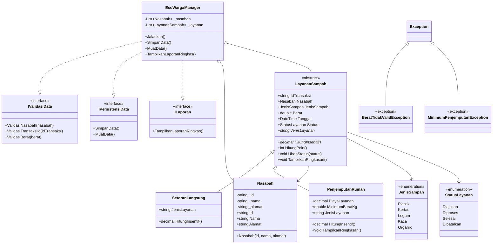

# Diagram Kelas EcoWarga

Diagram berikut bisa dibuka di editor Markdown yang mendukung Mermaid atau ditempel ke https://mermaid.live untuk dibuat menjadi gambar.

## Penjelasan Hubungan

1. `LayananSampah` adalah abstract class.
2. `SetoranLangsung` dan `PenjemputanRumah` mewarisi `LayananSampah`.
3. `HitungInsentif()` dioverride oleh masing-masing child class.
4. `EcoWargaManager` menyimpan transaksi dalam `List<LayananSampah>` sehingga polymorphism benar-benar digunakan.
5. `EcoWargaManager` mengimplementasikan tiga interface sekaligus.
